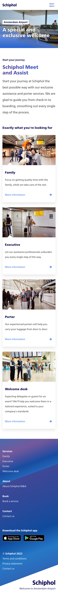
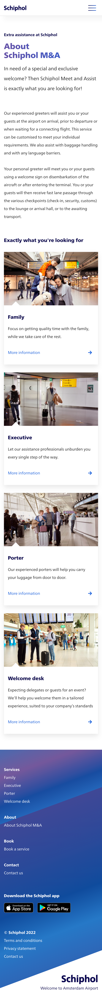
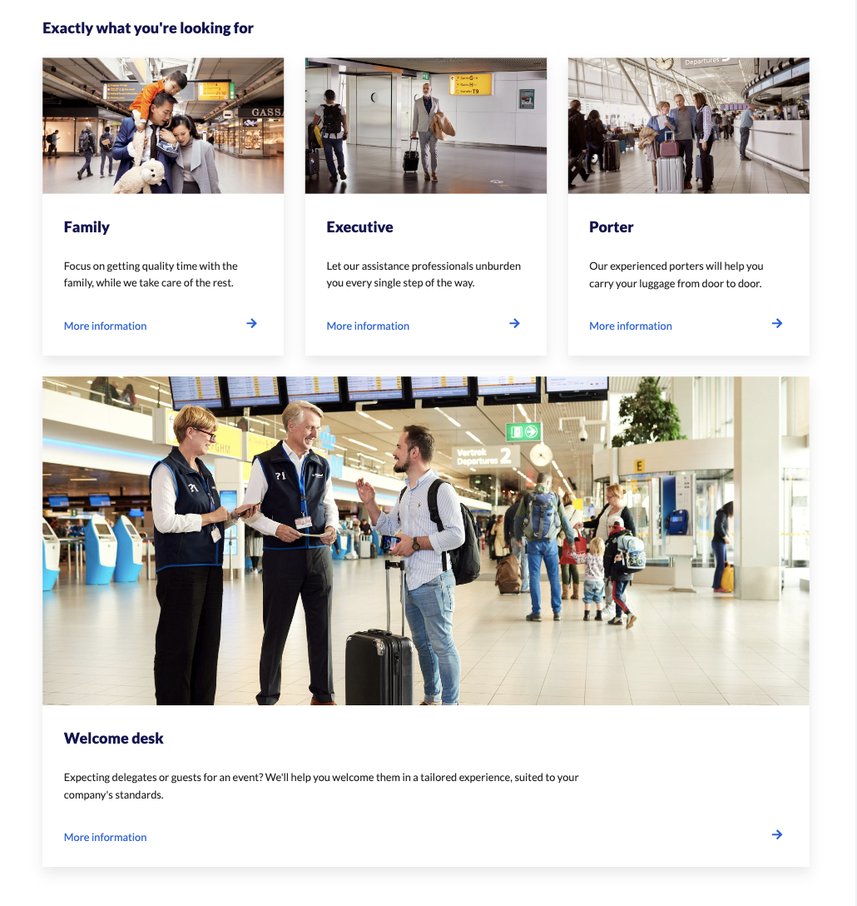
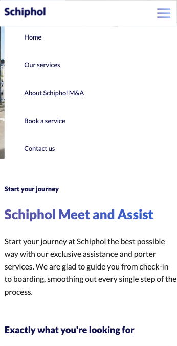

# Procesverslag
Markdown is een simpele manier om HTML te schrijven.  
Markdown cheat cheet: [Hulp bij het schrijven van Markdown](https://github.com/adam-p/markdown-here/wiki/Markdown-Cheatsheet).

Nb. De standaardstructuur en de spartaanse opmaak van de README.md zijn helemaal prima. Het gaat om de inhoud van je procesverslag. Besteedt de tijd voor pracht en praal aan je website.

Nb. Door *open* toe te voegen aan een *details* element kun je deze standaard open zetten. Fijn om dat steeds voor de relevante stuk(ken) te doen.

## Jij

  
uitwerken voor kick-off werkgroep

  ### Auteur:
  Rozemarijn Pol

  #### Je startniveau:
  Blauw

  #### Je focus:
  Responsive

## Je website

  
uitwerken voor kick-off werkgroep

  ### Je opdracht:
  https://schipholmeetandassist.com/

  #### Screenshot(s) van de eerste pagina (small screen): 
  Homepagina 
  

  #### Screenshot(s) van de tweede pagina (small screen):
  About Schiphol M&A
  
 

## Toegankelijkheidstest 1/2 (week 1)

  
uitwerken na test in 1e werkgroep

  ### Bevindingen
  Lijst met je bevindingen die in de test naar voren kwamen:

  #### Screenreader
  Ik heb het als erg lastig ervaren om middels de screenreader door de website te navigeren. Ten eerste vond ik de stem slecht verstaanbaar, door het hoge spraaktempo. Daarnaast vond ik het erg lastig om te begrijpen waar op de website ik precies was en hoe ik ergens anders kwam. Echter is dit voor iemand die blind is en dus niet zo visueel ingesteld als ik, wellicht makkelijker. 

  Mogelijk kan het tempo van de screenreader aangepast worden.

  #### Muis en Toetsenbord 
  Het was moeilijk om door de Schiphol website te navigeren met alleen het toetsenbord. Het is wel mogelijk, alleen zie je niet duidelijk waar je precies bent. In tegenstelling tot de site van Apple, waar er een soort blauwe border komt om het gedeelte waar je bent. 

  Hier een omschrijving van hoe het opgelost kan worden (met indien nodig afbeeldingen)

  #### Motoriek (shocks, elastiekjes)
  Test niet uitgevoerd.

  #### Visueel (brillen, contrast, kleurenblind, dark/light). 
  Met de bril op is de site van Schiphol opzich nog prima zichtbaar. Er is veel kleurcontrast in de achtergrond en de tekst. Alleen de fontsize kan wat groter als je slechte ogen hebt. 

## Breakdownschets (week 1)

  
uitwerken na afloop 2e werkgroep

  ### de hele pagina: 
  

  

## Voortgang 1 (week 2)

  
uitwerken voor 1e voortgang

  ### Stand van zaken
  De html schrijven ging er goed dankzij het maken van de breakdown schets. Door al duidelijk te hebben hoe de structuur moest worden ging het schrijven van de html sneller dan verwacht. 

  Ik ben wel even vastgelopen bij de html van de cards. Ik vond het lastig om te bepalen of een article in een section moet zitten, een section in een article, of misschien wel een section in een section. Op internet las ik over de verschillen tussen een article en een section. Ik begreep dat een article bedoeld is om content te markeren die opzichzelf staand is. Een section wordt gebruikt om content te markeren die onderdeel is van een groter geheel. Op basis van deze informatie heb ik de keuze gemaakt om de losse cards sections te maken die in een article staan. Het article is opzichzelf staand en de sections zijn een onderdeel van het article.

  Verder heb ik een begin gemaakt met de css. Zo heb ik de fonts toegevoegd en de h-elementen en p gestyled. Het was eventjes lastig om een gradient te geven aan de h2, maar met hulp van google is het gelukt.

  ### Agenda voor meeting
  samen met je groepje opstellen

  | student 1      | student 2          | student 3    | student 4        |
  | ---            | ---                | ---          | ---              |
  | dit bespreken  | en dit             | en ik dit    | en dan ik dat    |
  | en dat ook nog | dit als er tijd is | nog een punt | dit wil ik zeker |
  | ...            | ...                | ...          | ...              |

  ### Verslag van meeting
  hier na afloop snel de uitkomsten van de meeting vastleggen

  - Goede structuur
  - Al goed bezig met de css
  - Verder tot nu toe geen feedback

## Voortgang 2 (week 3)

  
uitwerken voor 2e voortgang

  ### Stand van zaken
  Deze week wilde ik de cards volledig klikbaar maken, dus niet alleen de buttons maar ook de afbeelding etc. Ik wist niet goed hoe ik dit moest doen en heb Robert een berichtje gestuurd, waarna hij mij wat tips heeft gegeven. Ik heb de sections in een a gezet waardoor deze volledig klikbaar zijn. Van de buttons heb ik p's gemaakt, omdat deze naar een andere pagina verwijzen en dus geen buttons zijn. Toen ontstond er een ander probleem, namelijk dat ik al een p had in de section die anders gestyled moest zijn. D.m.v. last of type heb ik de onderste p kunnen aanroepen en anders kunnen stylen.

  Verder ben ik doorgegaan met de css, waarbij ik tegen allerlei kleine dingen ben aangelopen. Maar dat kan ik me niet meer allemaal herinneren en is te veel om op te noemen.

  ### Agenda voor meeting
  samen met je groepje opstellen

  | student 1      | student 2          | student 3    | student 4        |
  | ---            | ---                | ---          | ---              |
  | dit bespreken  | en dit             | en ik dit    | en dan ik dat    |
  | en dat ook nog | dit als er tijd is | nog een punt | dit wil ik zeker |
  | ...            | ...                | ...          | ...              |

  ### Verslag van meeting
  hier na afloop snel de uitkomsten van de meeting vastleggen

  - Goed dat ik mijn bronnen goed bijhield
  - De volgorde van mijn h'tjes is niet helemaal semantisch correct. Ik zou de volgorde aankunnen passen en dan met order weer goed zetten. (Ik ben van mening dat dat mijn code een stuk omslachtiger maakt. Misschien nog met Robert bespreken.)
  - Footer titels in ul zetten zodat ik niet verschillende ul's heb waarin maar 1 a'tje zit.

## Toegankelijkheidstest 2/2 (week 4)

  
uitwerken na test in 8e werkgroep

  ### Bevindingen
  - Screenreader werkt niet goed
  - Navigeren met toetsenbord werkt beter dan op orginele site 
  - Mogelijk om met elastiekjes om vingers door site te navigeren
  - Navigeren door de site met visuele beperking is te doen

  #### Screenreader
  Het lukt mij erg slecht om door de site te navigeren met de screenreader. Misschien komt het omdat ik het gewoon niet goed begrijp. Maar zeker ook omdat de stem erg snel praat.

  #### Muis en Toetsenbord 
  Het is mogelijk om door alle links en knoppen te navigeren met alleen het toetsenbord. Er is duidelijk te zien waar op het scherm je precies bent. Terwijl dit bij de echte site niet zo is.

  #### Motoriek (shocks, elastiekjes)
  Met elastiekjes om mijn vingers is het mogelijk om door mijn website te navigeren. Welliswaar wat onhandiger, maar het gaat.

  #### Visueel (brillen, contrast, kleurenblind, dark/light). 
  Door het kleurcontrast in de achtergrond en de tekst is het goed te doen om met een visuele beperking door de site te navigeren.

## Voortgang 3 (week 4)

  
uitwerken voor 3e voortgang

  ### Stand van zaken
Het maken van een grid voor de cards vond ik lastig. Ik liep er tegen aan dat op de verschillende schermgroottes de cards anders weergegeven moesten worden. 

Ook was het lastig om de padding in de cards goed te krijgen. Uiteindelijk heb ik een div gebruikt om een textcontainer te maken, omdat ik geen andere oplossing zag.

Met behulp van een youtube tutorial heb ik een hamburger menu gemaakt.

  ### Agenda voor meeting
  samen met je groepje opstellen

  | student 1      | student 2          | student 3    | student 4        |
  | ---            | ---                | ---          | ---              |
  | dit bespreken  | en dit             | en ik dit    | en dan ik dat    |
  | en dat ook nog | dit als er tijd is | nog een punt | dit wil ik zeker |
  | ...            | ...                | ...          | ...              |

  ### Verslag van meeting
  hier na afloop snel de uitkomsten van de meeting vastleggen

  - Hamburgermenu moet met javascript
  - Ik heb de div in mijn code op de goede manier gebruikt
  - De div hoeft niet perse een class te hebben
  - 

## Eindgesprek (week 5)

  
uitwerken voor eindgesprek

  ### Je uitkomst - karakteristiek screenshots:
  

  ### Dit ging goed/Heb ik geleerd: 
  Ik heb geleerd hoe ik een website responsive kan maken met behulp van media queries. Voorheen had ik geen idee hoe dat werkte en of het mij ooit zou lukken om een website responsive te maken. Ik ben erg blij dat het mij is gelukt.

  Ook heb ik voor het eerst een hamburger menu gemaakt met JavaScript. Ik heb in eerdere html opdrachten weleens een hamburgermenu gemaakt met alleen html en css, maar nog nooit met JavaScript.
  
  Daarnaast heb ik geleerd te werken met een grid. Dankzij dit grid heb ik mijn cards kunnen opmaken en responsive kunnen maken. 

  Ik ben er erg trots op dat ik een website heb kunnen coderen, ondanks dat eerdere 'programmeervakken' moeizaam gingen. Ookal ambieer ik het niet om webdeveloper te worden, ben ik erg blij dat ik de basis begrijp. Ik hoop in mijn werk veel websites vorm te geven en ik denk dat ik er baat bij zal hebben dat ik begrijp hoe developers mijn ontwerpen gaan bouwen. 

  

  ### Dit was lastig/Is niet gelukt:
  Het is niet gelukt om het uitklapmenu van de navigatie helemaal kloppend te krijgen. Het is mij niet gelukt om het menu over de hele breedte en hoogte van het scherm te krijgen.

  

## Bronnenlijst

  
continu bijhouden terwijl je werkt

  Nb. Wees specifiek ('css-tricks' als bron is bijv. niet specifiek genoeg).

  1. https://www.youtube.com/watch?v=2KL-z9A56SQ
  2. https://developer.mozilla.org/en-US/docs/Web/CSS/Layout_cookbook/Card
  3. https://www.positioniseverything.net/html-article-vs-section
  4. https://css-tricks.com/snippets/css/complete-guide-grid/
  5. https://css-tricks.com/a-complete-guide-to-css-media-queries/
  6. https://www.youtube.com/watch?v=OFKBep95lb4
  7. https://www.youtube.com/watch?v=8QKOaTYvYUA
  8. https://www.youtube.com/watch?v=At4B7A4GOPg

